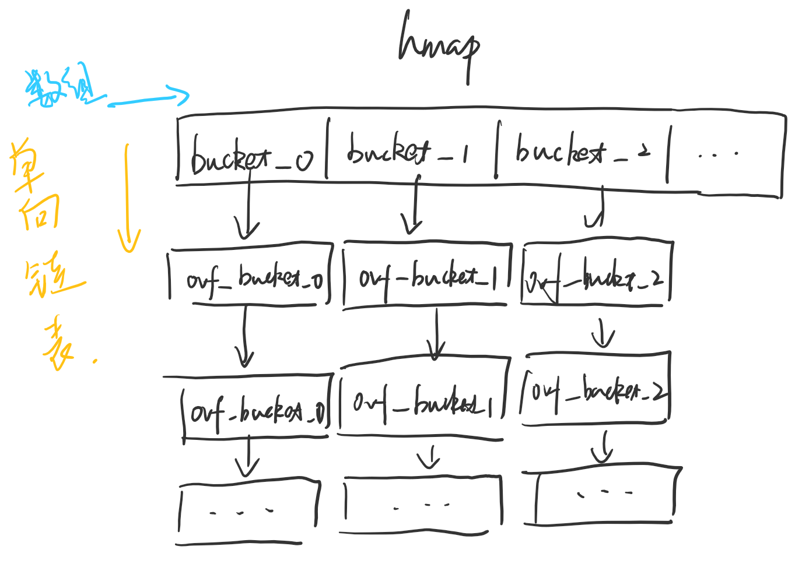
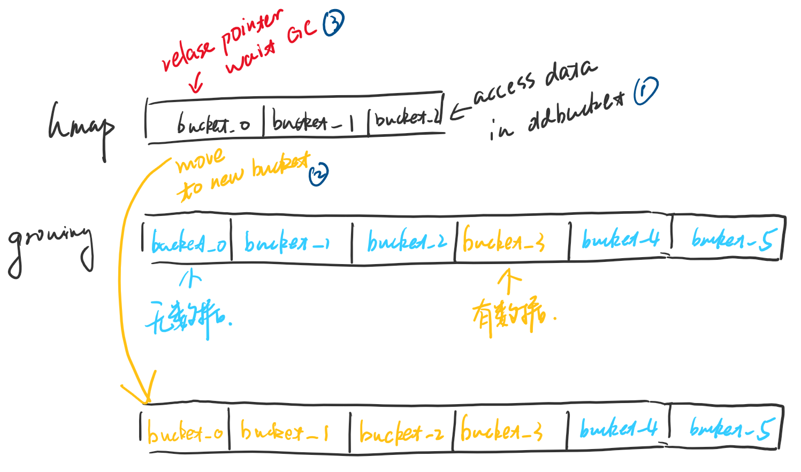

### Go Map

---

#### 定义

map底层实现的是是一个hashmap，data会被存储到一个bucket数组里，每个bucket最多存8个KV键值对。

#### 宣告及创建

```go
var m1 map[string]string  // ==> nil map

var m2 map[string]string{} // ==> empty map

var m3 map[string]string{
    "key1":"value1",
    "key2":"value2",
    "key3":"value3",
    "key4":"value4"
}
```

#### Map遍历

```go
for k,v ：= range m3 {
    fmt.Println(k,v)
}
```

map的key是无序的，所以每次遍历出来的结果也是无序的，因为底层go的map相当于是一个hash map

#### Map基本操作

**取**

Go中map取key对应value的形式就是 map[key]，取值的时候通常会有返回一个ok这个参数，表示这个key是否在这个map中存在。如果不存在就如m3["key6"]会返回false，在Go即使key不在map中也会返回一个宣告的Value的对应初始值，不会报错。

```go
key1Value,ok := m3["key1"]  // ==> "value1",true

key5Value := m3["key5"] // ==> ""

key6Value,ok := m3["key6"] // ==> "",false 
```

**删**

```go
delete(m3,"key1")
```

#### 底层原理

**怎么存？**

Go底层实现map，其实是实现一个哈希表，其中最重要的结构体是/src/runtime/map.go中的hmap和bmap结构体。

```go
// map底层实现的结构体
// /src/runtime/map.go
type hmap struct {
    count     int //元素个数，实现len()，所以可以用len来取map有多少个元素
	flags     uint8 //状态标志
	B         uint8  // 最多可以容纳 装载因子 * 2 ^ B个元素，B值等于取buckets总数的2的对数
	noverflow uint16 // 溢出的bucket个数
	hash0     uint32 // 哈希种子

	buckets    unsafe.Pointer // 指向bucket数组的指针，如果count为空，则该值为nil
	oldbuckets unsafe.Pointer // 当haspmap需要扩容时，指向旧bucket数组的指针，长度为旧bucket的一半
	nevacuate  uintptr // 迁移进度

	extra *mapextra // 用于扩容的指针
}
```

这个结构体里最重要的就是bucket 数组，因为Go中map用于存储的结构体是bucket数组。每个bucket里面会存8个kv键值对，每当bucket的kv键值对容量用完之后，会有一个overflow指针指向一个新的bucket，从而形成一个`链表结构`。下面是bucket的结构体，可以看到bucket这个结构体没有所谓的key，value，overflow字段，是因为读取kv的方式是`指针运算`。另外，从注释内可以看到，kv存储的方式也和以往的key/value/key/value...的形式不同，采用的是所有key打包在一起，所有value打包在一起的方式，即key/key/key.../value/value...的方式。这样做的方式虽然比旧有方式运算来得复杂，但是可以消除padding带来的空间浪费（这个地方是个人理解，会对内存的使用产生影响，但具体怎么影响还需要去了解下数据在硬盘中的存储方式）。

```go
// bucket结构体
type bmap struct {
	// tophash generally contains the top byte of the hash value
	// for each key in this bucket. If tophash[0] < minTopHash,
	// tophash[0] is a bucket evacuation state instead.
	tophash [bucketCnt]uint8
	// Followed by bucketCnt keys and then bucketCnt values.
	// NOTE: packing all the keys together and then all the values together makes the
	// code a bit more complicated than alternating key/value/key/value/... but it allows
	// us to eliminate padding which would be needed for, e.g., map[int64]int8.
	// Followed by an overflow pointer.
}
```


所以从上面两个结构体，我们可以得知Go Map底层存储的整体结构如下图：




**怎么读？**

Go底层通过哈希表实现map，哈希表顾名思义会有一个hash function来计算对应的hash值。Go也一样，针对map宣告的数据类型不同，用不同的hash function来计算hash值，在后面的源码中会看到。hash function在/runtime/alg.go里。

和其他hash function不同的是，Go通过hash function计算出来的值不是直接来当做key，而是将算出来的值分为高8位和低8位。为什么是8，因为bmap中的tophash定义的数据类型。高8位用来计算属于bucket中的哪个key，bmap中的tophash存的就是高8位的值，也可以理解为这个bucket有哪些key。低8位用来定位hmap中的哪个bucket。


下方代码块是Go中取value的方法源码，还有一个mapaccess2会返回一个bool值来表示这个key在这个map中是否存在。
map获取key对应的value永远都不会回传nil值，因为会有一个zero object用来返回不存在map中的key的value。

```go
func mapaccess1(t *maptype, h *hmap, key unsafe.Pointer) unsafe.Pointer {
	if raceenabled && h != nil {
		callerpc := getcallerpc()
		pc := funcPC(mapaccess1)
		racereadpc(unsafe.Pointer(h), callerpc, pc)
		raceReadObjectPC(t.key, key, callerpc, pc)
	}
	if msanenabled && h != nil {
		msanread(key, t.key.size)
	}
	if h == nil || h.count == 0 {
		if t.hashMightPanic() {
			t.key.alg.hash(key, 0)
		}
		return unsafe.Pointer(&zeroVal[0])
	}
	if h.flags&hashWriting != 0 {
		throw("concurrent map read and map write")
	}
    // 通过maptype来获取对应的hash function，算出hash值
	alg := t.key.alg
	hash := alg.hash(key, uintptr(h.hash0))
	m := bucketMask(h.B)
	b := (*bmap)(add(h.buckets, (hash&m)*uintptr(t.bucketsize))) //低位计算属于哪个bucket
	if c := h.oldbuckets; c != nil {
		if !h.sameSizeGrow() {
			m >>= 1
		}
		oldb := (*bmap)(add(c, (hash&m)*uintptr(t.bucketsize)))
		if !evacuated(oldb) {
			b = oldb
		}
	}
	top := tophash(hash) //高位计算bucket中对应的key
bucketloop:
	for ; b != nil; b = b.overflow(t) { //当前bucket找不到对应的key去overflow指向的bucket找
		for i := uintptr(0); i < bucketCnt; i++ {
            // 找是否有匹配的高8位
			if b.tophash[i] != top {
				if b.tophash[i] == emptyRest {
					break bucketloop
				}
				continue
			}
			k := add(unsafe.Pointer(b), dataOffset+i*uintptr(t.keysize)) //指针运算计算获取key的位址
			if t.indirectkey() {
				k = *((*unsafe.Pointer)(k))
			}
			if alg.equal(key, k) {
				v := add(unsafe.Pointer(b), dataOffset+bucketCnt*uintptr(t.keysize)+i*uintptr(t.valuesize)) //指针运算计算value的位址
				if t.indirectvalue() {
					v = *((*unsafe.Pointer)(v))
				}
				return v
			}
		}
	}
	return unsafe.Pointer(&zeroVal[0]) //永远有一个zero object来return
}
```

**怎么写

Go底层map存数据(map[k] = v)的方法主要是mapassign这个函数。和mapaccess类似，都要先算出hash值，然后找到对应的位置，mapassign的区别在于这个位置可能不存在及扩容问题。

```go
func reflect_mapassign(t *maptype, h *hmap, key unsafe.Pointer, val unsafe.Pointer) {
	p := mapassign(t, h, key)
	typedmemmove(t.elem, p, val)
}

func mapassign(t *maptype, h *hmap, key unsafe.Pointer) unsafe.Pointer {
	if h == nil {
		panic(plainError("assignment to entry in nil map"))
	}
	if raceenabled {
		callerpc := getcallerpc()
		pc := funcPC(mapassign)
		racewritepc(unsafe.Pointer(h), callerpc, pc)
		raceReadObjectPC(t.key, key, callerpc, pc)
	}
	if msanenabled {
		msanread(key, t.key.size)
	}
	if h.flags&hashWriting != 0 {
		throw("concurrent map writes")
	}
    
    // 计算hash值
	alg := t.key.alg
	hash := alg.hash(key, uintptr(h.hash0))

	h.flags ^= hashWriting

    // 如果hmap的bucket为空，则需要先创建一个新的bucket数组，底层用mallocgc实现。
	if h.buckets == nil {
		h.buckets = newobject(t.bucket) // newarray(t.bucket, 1)
	}

again:
	bucket := hash & bucketMask(h.B)
    // 如果hmap正在扩容，会把老数据迁移到新的位址去，具体见下面的map扩容。
	if h.growing() {
		growWork(t, h, bucket)
	}
    
    // 找到对应的bucket
	b := (*bmap)(unsafe.Pointer(uintptr(h.buckets) + bucket*uintptr(t.bucketsize)))
	top := tophash(hash) //计算高8位

	var inserti *uint8
	var insertk unsafe.Pointer
	var val unsafe.Pointer
bucketloop:
	for {
		for i := uintptr(0); i < bucketCnt; i++ {
            // 找到一个bucket中tophash[i]的值不为top，并且这个tophash的值不为空及inserti为空的位址，然后赋值。
			if b.tophash[i] != top {
				if isEmpty(b.tophash[i]) && inserti == nil {
					inserti = &b.tophash[i]
					insertk = add(unsafe.Pointer(b), dataOffset+i*uintptr(t.keysize))
					val = add(unsafe.Pointer(b), dataOffset+bucketCnt*uintptr(t.keysize)+i*uintptr(t.valuesize))
				}
                
                // emptyRest表示，这个对应的bucket及其overflow bucket都没有多余的空间，则需要建新的cell或新的entry，跳到91行
				if b.tophash[i] == emptyRest {
					break bucketloop
				}
				continue
			}
			k := add(unsafe.Pointer(b), dataOffset+i*uintptr(t.keysize))
			if t.indirectkey() {
				k = *((*unsafe.Pointer)(k))
			}
			if !alg.equal(key, k) {
				continue
			}
            
			// 如果这个key已经存在就需要替换掉原来的值
			if t.needkeyupdate() {
				typedmemmove(t.key, k, key)
			}
			val = add(unsafe.Pointer(b), dataOffset+bucketCnt*uintptr(t.keysize)+i*uintptr(t.valuesize))
			goto done
		}
		ovf := b.overflow(t)
		if ovf == nil {
			break
		}
		b = ovf
	}

    // 如果达到扩容因子最大值，或者有太多的overflow bucket，并且hmap没有在扩容状态，则需对hmap扩容。
	if !h.growing() && (overLoadFactor(h.count+1, h.B) || tooManyOverflowBuckets(h.noverflow, h.B)) {
		hashGrow(t, h)
		goto again // Growing the table invalidates everything, so try again
	}

    // 如果当前所有的bucket及其overlow bucket都满了，就需要建一个新的overflow bucket
	if inserti == nil {
		newb := h.newoverflow(t, b)
		inserti = &newb.tophash[0]
		insertk = add(unsafe.Pointer(newb), dataOffset)
		val = add(insertk, bucketCnt*uintptr(t.keysize))
	}

	if t.indirectkey() {
		kmem := newobject(t.key)
		*(*unsafe.Pointer)(insertk) = kmem
		insertk = kmem
	}
	if t.indirectvalue() {
		vmem := newobject(t.elem)
		*(*unsafe.Pointer)(val) = vmem
	}
	typedmemmove(t.key, insertk, key)
	*inserti = top
	h.count++

done:
	if h.flags&hashWriting == 0 {
		throw("concurrent map writes")
	}
	h.flags &^= hashWriting
	if t.indirectvalue() {
		val = *((*unsafe.Pointer)(val))
	}
	return val
}
```

**map扩容**

Go中map bucket数量的初始化是根据hamp中的b，即扩容因子定义的，见/src/runtime/map.go中的mapBufferArray函数。

map扩容条件：

· bucket及其overflow bucket已经写满的时候可以扩容；

· 当元素> 6.5 * #bucket 的时候可扩容；

· 非扩容状态下才可以扩容。

map扩容迁移数据的方式：

map扩容时，会创建一个为原来bucket数组两倍大的新bucket数组，写入新数据，用一个指针来指向旧的bucket数组。Go map不会在扩容后就一下子把旧的数据移到新的bucket数组内，只有当1触发，即访问到旧数据的时候。然后执行2，通过指向旧数据的指针找到对应的旧数据，重新计算hash值后hash到新的bucket数组去。最后3，把指向旧bucket数组的指针释放掉，等待gc。

