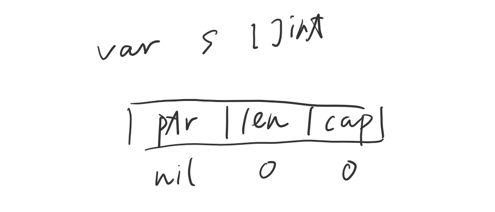

### Go Slice 切片

---

#### 定义

Go的slice不单单是切片动作，同时也是一种**`数据结构`**。Go中的slice依赖于array，它的底层就是数组。

Slice的类型规范是[] T，Slice类型没有指定的长度

#### Slice实现

ptr：指向slice开头的元素

len：slice的长度，用[index]只能取长度内的值

cap：从ptr开始到array结束的整个长度，不超过这个cap都可以扩展


```go
func main() {
    arr := [0,1,2,3,4,5,6,7]
    
    s1 := arr[2:6]
	fmt.Printf("s1=%v  len(s1)=%d cap(s1)=%d\n", s1, len(s1), cap(s1))

	s2 := s1[3:5]
	fmt.Printf("s2=%v  len(s2)=%d cap(s2)=%d", s2, len(s2), cap(s2))
}
```

```bash
#output
s1=[100 3 4 5]  len(s1)=4 cap(s1)=6
s2=[5 6]        len(s2)=2 cap(s2)=3
```

#### Slice声明与创建

slice声明，没有初始化的slice位nil slice

```go
var s []int
```



slice的创建可以是用make，直接赋值或直接从数组中创建切片

· 空slice

```go
var e_s = make([]int,0)
```


· make

声明一个length为3，Capacity为5，数据类型为int的底层数组，然后取index 0,1,2，三个元素作为slice的结构。因为数组make初始化的关系，fmt.Println(s) => [0 , 0 , 0]

```go
s := make([]int,3,5)
```

· 直接赋值

```go
s := []int{1,2,3,4}
```

· 从数组中创建切片

遵循半开半闭原则

```go
arr := [...]int{1, 2, 2, 3, 4, 5, 6}
s := arr[2:6] //半开半闭，2包括，6不包括
// s = [2,3,4,5]
```

#### Slice的访问

slice的访问和数组差不多，也可以使用下标或range访问。

**使用下标访问时，只能访问小于length的下标。**

#### Slice是引用类型

slice可以理解为从一个底层数组中，选取一些元素，然后返回这个元素的集合，最后用slice指向集合的第一个元素。也可以理解为，slice其实是一个指针，指向了底层数组中某些元素的集合。

```go
func updateSlice(s []int){
	s[0] = 100
}

func main() {
	arr := [...]int{1, 2, 2, 3, 4, 5, 6}

	fmt.Println("array[2:6] = ", arr[2:6])
	fmt.Println("array[:6] = ", arr[:6])

	s1 := arr[2:]
	fmt.Println("array[2:] = ", s1)

	s2 := arr[:]
	fmt.Println("array[:] = ", s2)

	updateSlice(s1)
	fmt.Println("s1 after update = ", s1)

	updateSlice(s2)
	fmt.Println("s2 after update = ", s2)
}
```

```bash
#output
array[2:6] =  [2 3 4 5]
array[:6] =  [0 1 2 3 4 5]
array[2:] =  [2 3 4 5 6 7]
array[:] =  [0 1 2 3 4 5 6 7]
s1 after update =  [100 3 4 5 6 7]
s2 after update =  [100 1 100 3 4 5 6 7]
```

#### Slice的ReSlice

对slice做slice是可以的，生成的slice都是对同一个数组的view。

切片不会复制切片，会创建一个指向原始数组的新切片值。

```go
func main() {
	arr := [...]int{1, 2, 2, 3, 4, 5, 6}

	s1 := arr[2:]
	fmt.Println("s1 = ", s1)

	s1 = arr[3:]
    fmt.Println("s1[1:3] = ", s1)
}
```

```bash
#output
s1 =  [100 3 4 5 6 7]
s1[1:3] =  [3 4]
```

#### Slice的扩展

· 可以通过appen()来对slice扩展。

· slice可以向后扩展，但不可以向前扩展

· s[i]不能超过len(s)，向后扩展不可以超越底层数数组cap(s)，这里指地是通过取下标方式，可参考下面例子。如果append()超过会生成一新的底层数组，返回给新的slice。

· 当底层数组需要扩容时，**仅当Capacity需要<font color="red">扩容</font>的时候**，会按照当前底层数组长度的2倍进行扩容，并生**成新数组**。如果底层数组的长度超过1000时，将按照25%的比率扩容，也就是1000个元素时，将扩展为1250个。

```go
func main() {
    oldSlice := []int{1, 2, 3, 4, 5}
	newSlice := append(oldSlice, 6)

	fmt.Println(oldSlice)
	fmt.Println(newSlice)

	fmt.Printf("oldSlice=%v  len(oldSlice)=%d cap(oldSlice)=%d\n", oldSlice, len(oldSlice), cap(oldSlice))
	fmt.Printf("newSlice=%v  len(newSlice)=%d cap(newSlice)=%d\n", newSlice, len(newSlice), cap(newSlice))
}
```

```bash
#output
[1 2 3 4 5]
[1 2 3 4 5 6]
oldSlice=[1 2 3 4 5]  len(oldSlice)=5 cap(oldSlice)=5
newSlice=[1 2 3 4 5 6]  len(newSlice)=6 cap(newSlice)=10
```

**延伸思考1**：例子中s2是否会因为长度不够而报错？

```go
arr := [...]int{0,1,2,3,4,5,6,7}
s1 := arr[2:6]
s2 := s1[3:5]
```

答案是不会的，根据slice实现及下图可以这么理解。

s1取了arr[2:6]的view，所以s1的下标就是0,1,2,3，但是因为s1是arr的view，所以不会到3就结束，会一直到arr结束的下标，在s1中就是5。虽然s1[4]和s1[5]是取不出元素的，但是s1知道底层有这么个元素。

s2=s1[3:5]，同理，s2的下标就有0,1,2，那0,1对的是s1的3,4，即对应到arr的下标就是5,6，取出的值就是5,6。


如果定义s2 = s1[3:5:2]，s2就不会知道下标2对应的元素

**延伸思考2**：下面例子的append() 会影响什么？

```go
s1 := []int{1,2,3,4,5}
s1_slice := s1[1:3]
s2 := append(s1_slice, 44)
```

答案是append之后s1[3] = 44，理由如图：

主要原因还是因为，底层数组指向的还是同一个。s1_slice取index=2是没有值的，但是append之后下标2就变成了44。那因为下标2指向的是底层数组的下标3，所以s1[3]=44。


#### Slice的Copy

函数copy在两个slice间赋值数据，赋值长度以len小为准，两个silce可指向同一底层数组

```go
func main() {
	data := [...]int{0, 1, 2, 3, 4, 5, 6, 7, 8, 9}
    v1 := data[8:] //{8, 9}
    v2 := data[:5] //{0, 1, 2, 3, 4}
    copy(v2, v1)   // dst:s2, src:s1

    fmt.Println(v2)   //[8 9 2 3 4]
    fmt.Println(data) //[8 9 2 3 4 5 6 7 8 9]
}
```


