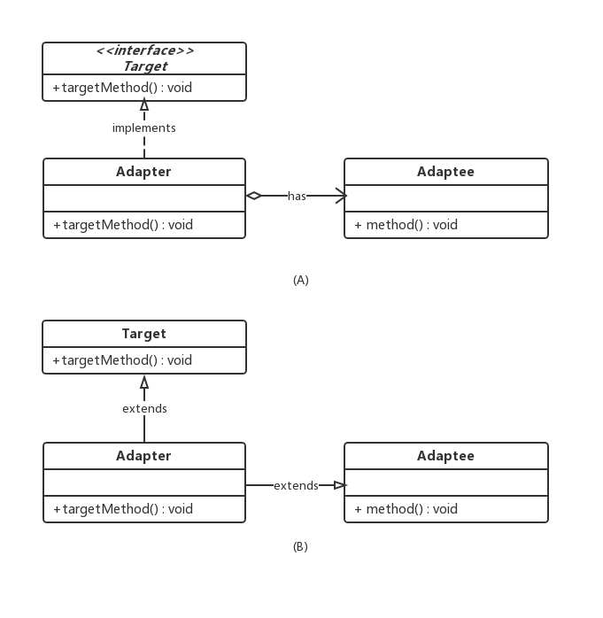
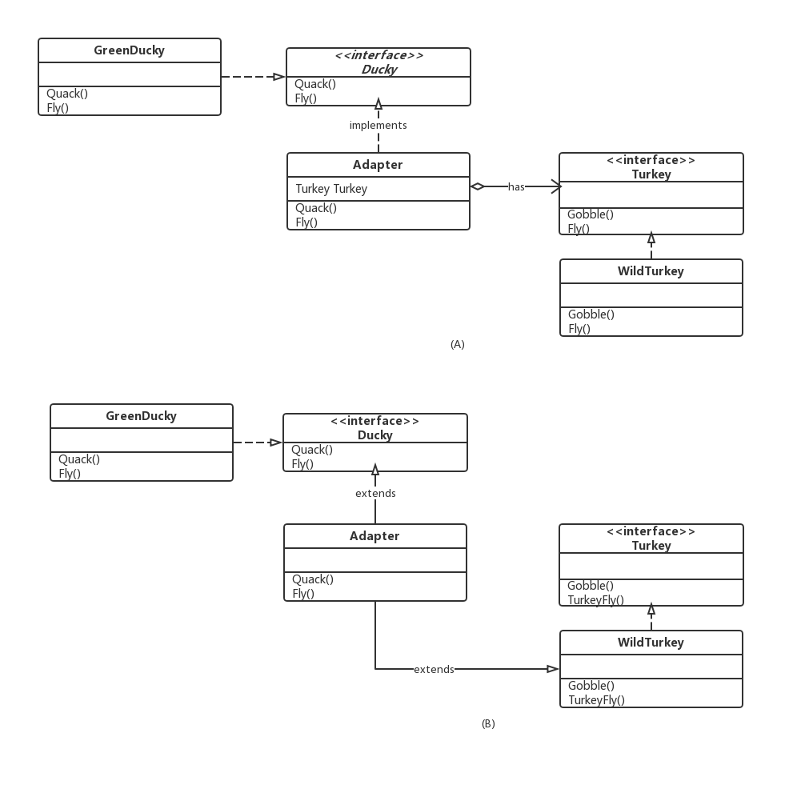

### 适配器模式(Adapter Pattern)

---

<font size="5">**适配器模式**</font>将一个类的接口，转换成客户期望的另一个接口。适配器让原本接口不兼容的类可以合作无间。

---

**看个例子**

还记得策略模式里的鸭子接口吗？假设这些鸭子类是属于农场的，农场通过Quack和Fly观察着鸭子的情况。今天这个农场又要多养一些火鸡，农场主希望不要改变原来Quack和Fly的方法来观察养的动物。如果直接让火鸡实现Duck接口也不太现实，火鸡毕竟不是鸭子，火鸡的叫法也不是Quack。不过，我们能否创建一支披着鸭皮的火鸡呢？

```go
type Ducky interface{
    Quack()
    Fly()
}

type Turkey interface{
    Gobble()
    Fly()
}
```

---

**意图**

将类的接口转换为兼容的接口，一个适配器允许不兼容的类一起工作

---

**组成部分**

- Target

  目标接口，一般是我们想用适配器转换获取的新的目标接口(Duck)

- Adaptee

  被适配者，适配器应用的对象(Turkey)

- Adapter

  适配器，转换接口的类



---

**实现方式**

- 对象适配器

  对象适配器的实现如上图的A，非多继承或继承，用委托的方式。对象实现适配器模式，可以让被适配者的子类都搭配着适配器使用。

- 类适配器

  类适配器的实现如上图的B，使用多继承或继承的方式来实现，好处在于不用像对象那样实现所有的方法。

---

**范例代码**

代码：https://github.com/zxmfke/tech_learning_NoteOrBook/edit/master/design_pattern/adapter_pattern/example
分别用对象适配器和类适配器实现适配器模式范例代码

这两种方式的主要区别在于Adapter中Quack的实现方式



---

**总结**

- 这个模式可以通过创建适配器进行接口转换，让不兼容的接口变成兼容。
- 如果想要改变接口，适配器部分可以将改变的部分封装起来，客户就不必为了应对不同的接口而每次跟着修改。
- 客户和被适配者是解耦的。
