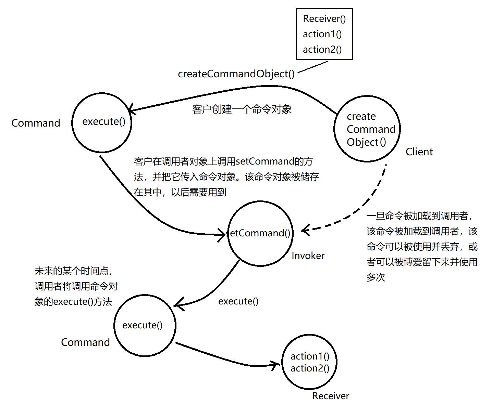
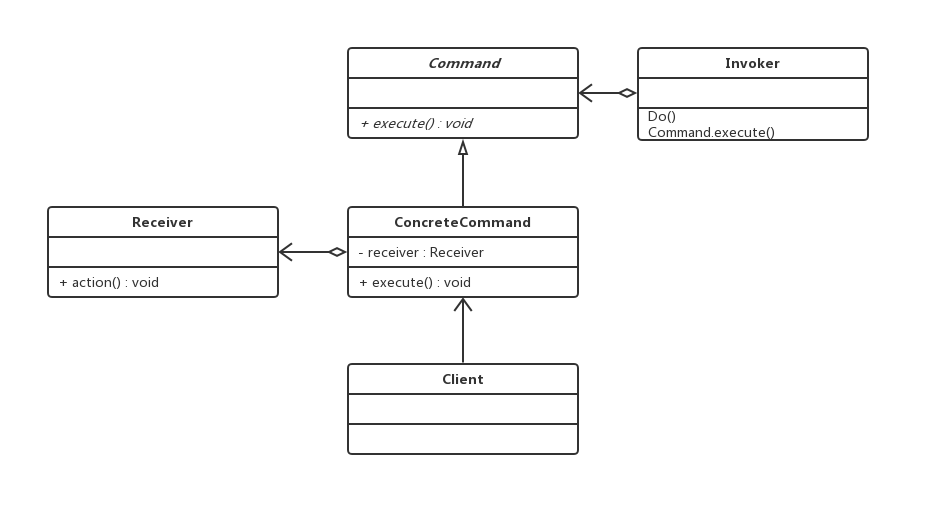

### 命令模式(Command Pattern)

---

**命令模式**将一个请求封装为一个对象，从而是你可用不同的请求对客户进行参数化，对请求排队或记录请求日志以及支持可撤销的操作。

---

**看个例子**

一个场景：餐厅点餐，出餐

1）点餐：一个芝士汉堡，产生一个芝士汉堡的订单（createOrder）

2）服务员拿走订单（takeOrder）

3）把订单交到后厨（orderUp）

3）厨师接过订单，开始烹饪（make）

4）出餐

从这个流程来思考对象和方法的调用关系，对象的角色和职责

· 一张订单封装准备餐点的请求

把订单想象成一个用来请求准备餐点的对象，订单对象可以被传递。订单的接口只包含一个方法就是orderUp()。这个方法封装了准备餐点所需的动作。订单有一个到“需要进行准备工作的对象”的引用。这一切都被封装起来，所以**服务员不需要知道订单上有什么**，也不需要知道是谁来准备餐点；她只需要将订单放到订单窗口，说一声订单来了即可。

· 服务员的工作只有接收订单，然后调用orderUp()方法

服务员的工作很简单：接下顾客的订单，继续帮助下一个顾客，然后将一定数量的订单放到订单柜台，并调用orderUp()，让人来准备餐点。服务员不需要担心知道订单的内容是什么，或者由谁来准备餐点。只需要知道，订单有一个orderUp()方法可以调用，这就够了。

· 厨师具备准备餐点的知识

厨师是一种对象，他真正知道如何准备餐点。一旦服务员调用orderUp()的方法，厨师就接收，实现需要创建餐点的所有方法。服务员和厨师之间是彻底的解耦，**服务员和厨师之间无须沟通**，服务员的订单封装了餐点的细节，服务员只要调用每个订单的方法即，而厨师看了什么订单就知道该做些什么餐点。

**例子的关键点在于，我们需要设计一种模型来将“发出请求的对象”和“接受与执行这些对象的请求”分隔开来。**

**从例子转向命令模式**

· 服务员 => Invoker

· 厨师 => Reveiver

· orderUp() => execute()

· 订单 => Command

· 顾客 => Client

· takeOrder() => setCommand()

---

#### 认识设计模式

一个命令对象通过在特定接收者上绑定一组动作来封装一个请求。要达到这一点，命令对象将动作和接收者包进对象中。这个对象只暴露一个execute()方法，但此方法被调用的时候，接收者就会进行这些动作。从外面来看，其他对象不知道究竟哪个接收者进行了哪些动作，只知道如果调用execute()方法请求的目的就会达到。

在命令模式中，命令对象并不知道如何处理命令，会有相应的接收者对象来真正执行命令。就像订单和厨师的关系。

命令模式的关键之处就是把请求封装成对象，也就是命令对象，并定义统一的执行操作的接口，这个命令对象可以被存储、转发、记录、处理、撤销等，整个命令模式都是围绕这个对象进行的。

**命令模式类图**

- Command：

  定义命令的接口，声明执行的方法

- ConcreteCommand：

  命令接口实现对象，是“虚”的实现；通常会从持有接收者，并调用接收者的功能来完成命令要执行的操作

- Receiver：

  接收者，真正执行命令的对象。任何类都可能成为一个接收者，只要它能够实现命令要求实现的相应功能

- Invoker：

  要求命令对象执行请求，通常会持有命令模式，可以持有很多的命令对象。这个是客户端真正触发命令并要求命令执行相应操作的地方，也就是说相当于使用命令对象的入口

- Client：

  创建具体的命令对象，并且设置命令对象的接收者。注意这个不是我们常规意义上的客户端，而是在组装命令对象和接收者，或许，把这个Client称为装配者会更好理解，因为真正使用命令的客户端是从Invoker来触发执行。

  

---

#### 优点

· 更松散的耦合
   命令模式使得发起命令的对象 --- 客户端，和具体实现命令的对象 --- 接收者对象完全解耦，也就是说发起命令的对象完全不知道具体实现对象是谁，也不知道如何实现。

· 更好的扩展性
   由于发起命令的对象和具体的实现完全解耦，因此扩展新的命令就很容易，只需要实现新的命令对象，然后在装配的时候，把具体的实现对象设置到命令对象中，然后就可以使用这个命令对象，已有的实现完全不用变化。

· 更动态的控制
  命令模式把请求封装起来，可以动态地对它进行参数化、队列化和日志化等操作，从而使得系统更灵活。

---

#### 何时使用命令模式

· 如何需要抽象出需要执行地动作，并参数化这些对象，可以选用命令模式。将这些需要执行地动作抽象成为命令，然后实现命令地参数化配置。

· 如果需要在不同地时刻指定、排列和执行请求，可以选用命令模式。

· 如果需要支持取消操作，可以选用命令模式，通过管理命令对象，能很容易地实现命令地回复和重做功能。

· 在需要事务的系统中，可以选用命令模式。命令模式提供了对事务进行建模的方法。命令模式有一个别名就是Transaction。

---

#### 范例代码

代码 ：https://github.com/zxmfke/tech_learning_NoteOrBook/edit/master/design_pattern/command_pattern/example

代码实现一个简单的遥控器，通过设定不同的命令来控制电灯。

