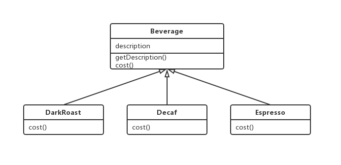
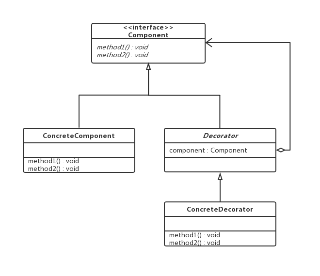
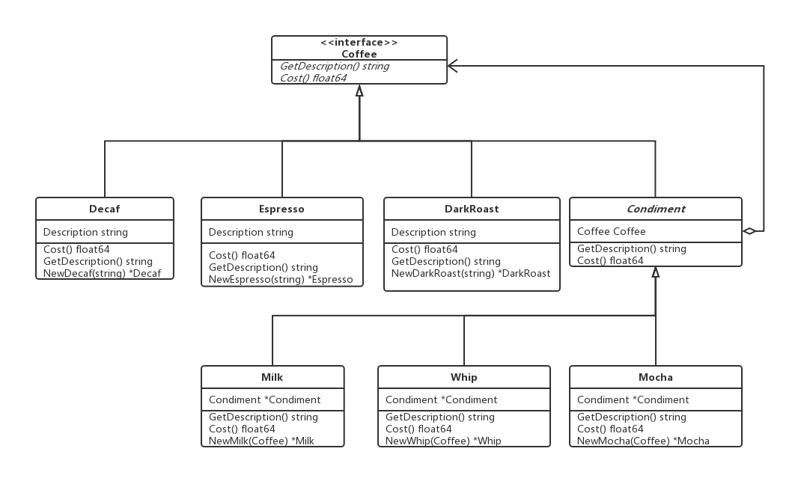

### 装饰者模式(Decorator Pattern)

---

 **装饰者模式**动态地将责任附加到对象上。若要扩展功能，装饰者提供了比继承更有弹性的替代方案。

---

**看个例子**

设计一个饮料订单系统，一个饮料类(Beverage)，有自己的描述，计算价格和取得描述的方法，一个新的饮料只要继承这个饮料类，实现自己计算价格的方法就好了。

上面讲到了一个新的饮料，这新的饮料有多少？好像有很多，那我们生成好多好多的新的饮料类，并且自己去实现计算价格的 方法。这么做会崩溃的，更何况有些饮料是由多种饮料，调料，调制而成。如何能让系统去适应新的扩展，而不用影响到原来的代码，是这个模式主要思考的问题。

---

**###设计原则**

> **开放-关闭原则。类应该对扩展开放，对修改关闭。**

目标是允许类容易扩展，在不修改现有代码的情况下，就可以搭配新的行为。如果能实现这样的目标，有什么好处呢？这样的设计具有弹性可以应对改变，可以接受新的功能来应对改变的需求。

虽然似乎有点矛盾，但是的确有一些技术可以允许在不直接修改代码的情况下对其进行扩展。在选择需要被扩展的代码部分时要小心。每个地方都采用开放-关闭原则，是一种浪费，也没必要。

---

**意图**

增加一个对象对新行为的动态的扩展性

---

**组成部分**

- Component（被装饰对象的基类）

  定义一个对象接口，可以给这些对象动态地添加职责。

- ConcreteComponent（具体被装饰对象）

  定义一个对象，可以给这个对象添加一些职责。

- Decorator（装饰者抽象类）

  维持一个指向Component实例的引用，并定义一个与Component接口一致的接口。

- ConcreteDecorator（具体装饰者）

  具体的装饰对象，给内部持有的具体被装饰对象，增加具体的职责。

  

---

**范例代码**

代码：http://192.168.1.189/navi/wiki/tree/master/msa/design_pattern/decorator_pattern/example

Coffee是一个interface，Decaf，Espresso，DarkRoast和Condiment实现GetDescription和Cost方法。Condiment实现了一个对Coffee对象的指定。Milk，Whip和Mocha实现并覆写了Coffee interface的方法。Milk，Whip和Mocha装饰着Coffee。

---

**总结**

- 组合和委托可用于在运行时动态地加上新的行为。
- 装饰者类反映出被装饰的组件类型（实际上，他们具有相同的类型，都经过接口或继承实现）。
- 装饰者一般对组建的客户是透明的，除非客户程序依赖于组件的具体类型。
- 装饰者主要用于避免类爆炸。