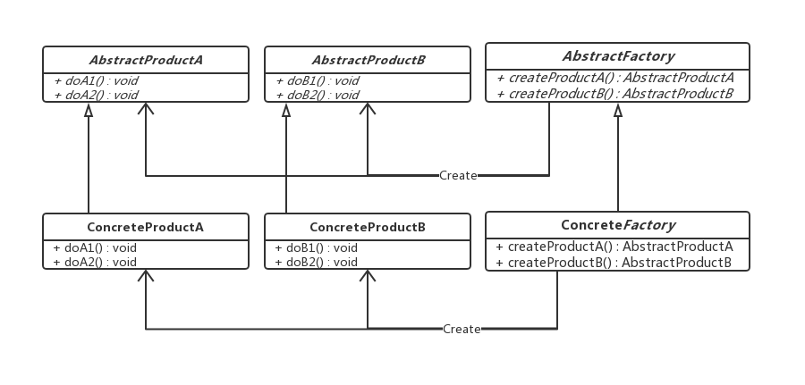
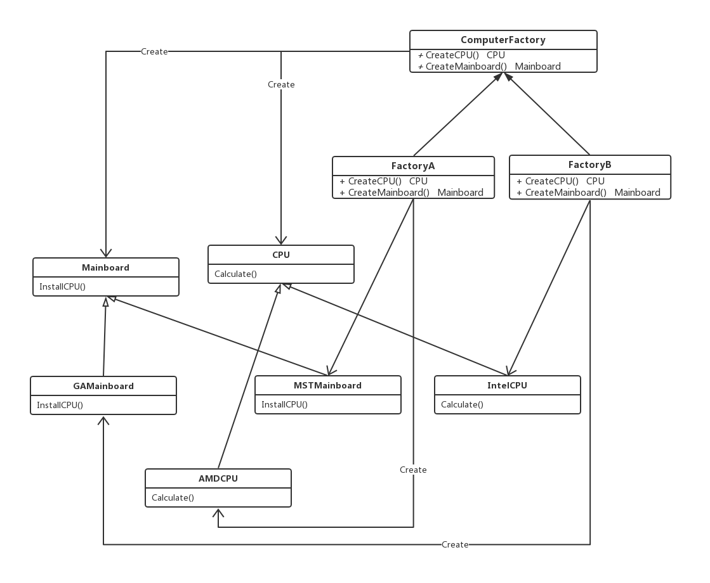

### 抽象工厂模式(Abstract Factory Pattern)

------

<font size="5">**抽象工厂模式**</font>提供了一个接口，用于创建相关或依赖对象的家族，而不需要明确指定具体类

------

**看个例子**

设计一个装机系统，由客户选择装机的组件，交给装机师傅安装，分为四个部分。

第一部分是声明CPU和主板接口，CPU接口需要实现Calculate方法，主板接口需要实现InstallCPU方法。分别声明IntelCPU，AMDCPU，GAMainboard和MTSMainboard。

第二部分工厂用于生成对应的CPU和主板。

第三部分装机师傅，实现组装电脑的方法。

第四部分用户选择组件，交给装机师傅组装。

```go
type CPUApi interface {
    Calculate() //计算pin脚
}

type MainboardApi interface {
    InstallCPU()
}

//intel CPU
type IntelCPU struct{
    pins int
}

func NewIntelCPU(pins int) &IntelCPU{
    return &IntelCPU{
        pins : pins,
    }
}

func (i *IntelCPU) Calculate() {
    fmt.Printf("in intel CPU is %s pins",i.pins)
}

//AMD CPU
type AMDCPU struct{
    pins int
}

func NewAMDCPU(pins int) &AMDCPU{
    return &AMDCPU{
        pins : pins,
    }
}

func (a *AMDCPU) Calculate() {
    fmt.Printf("in AMD CPU is %s pins",a.pins)
}

//GAMainboard
type GAMainboard struct{
    cpuHoles int
}

func NewGAMainboard(cpuHoles int) &GAMainboard{
    return &GAMainboard{
        cpuHoles : cpuHoles,
    }
}

func (g *GAMainboard) InstallCPU() {
    fmt.Printf("in GA Mainboard is %s cpu holes",g.cpuHoles)
}

//MSTMainboard
type MSTMainboard struct{
    cpuHoles int
}

func NewMSTMainboard(cpuHoles int) &MSTMainboard{
    return &MSTMainboard{
        cpuHoles : cpuHoles,
    }
}

func (m *MSTMainboard) InstallCPU() {
    fmt.Printf("in MST Mainboard is %s cpu holes",m.cpuHoles)
}

```

```go
func CPUApiFactory(typ int) CPUApi{
    if typ == 1 {
        return NewIntelCPU(1156)
    } else {
        return NewAMDCPU(939)
    }
}

func MainboardFactory(typ int) CPUApi{
    if typ == 1 {
        return NewGAMainboard(1156)
    } else {
        return NewMSTMainboard(939)
    }
}
```

```go
type Engineer struct{}

func (e *Engineer) MakeComputer(cpuType, mainboardType int) {
    prepareHardwares(cpuType,mainboardType)
}

func (e *Engineer) prepareHardwares(cpuType, mainboardType int) {
    cpuApi := CPUApiFactory(cpuType)
    mainboard := MainboardFactory(mainboardType)
    
    cpuApi.Calculate()
    mainboard.InstallCPU()
}
```

```go
engineer := Engineer{}
engineer.makeComputer(1,1)
```

该系统对装机工程师而言，只是知道CPU和主板的接口，而不知道具体实现，所以可以用简易工厂模式或工厂方法模式。这里的代码通过简易工厂 模式实现，客户告诉装机工程师自己的选择，然后装机工程师会通过相应的工厂去获取相应的实例对象。然而，看似简易工厂解决了装机系统的需求，但是由于主板和CPU之间是有关联的，是需要互相匹配的，因此可能出现如下情况。客户端选择的是cpuType = 1和mainboard= 2，pin脚为1156而cpuHole才939，这样根本无法组装电脑。

---

**意图**

将对象族的创建与其用法隔离开来，并指定它们的具体类型

---

**组成部分**

- Abstract Factory：抽象工厂，定义创建一系列产品对象的操作接口。
- Concrete Factory：具体的工厂，实现抽象工厂定义的方法，具体实现一系列产品对象的创建
- Abstract Product：定义一类产品对象的接口
- Concrete Product：具体的产品实现对象，通常在具体工厂里面，会选择具体的产品实现对象，来创建符合抽象工厂定义的方法返回的产品类型的对象。



---

**范例代码**

代码：https://github.com/zxmfke/tech_learning_NoteOrBook/edit/master/design_pattern/factory_pattern/factory_pattern_abstract_factory/example

范例代码通过抽象工厂模式将原本的简易工厂模式修改了一下



---

**总结**

- 抽象工厂着重的就是为了一个产品簇选择实现，定义在抽象工厂里面的方法通常是有联系的，它们都是产品的某一部分或者是相互依赖的。如果抽象工厂里面只定义一个方法，直接创建产品，那么就退化为工厂方法。
- 客户端使用抽象工厂来创建需要的对象，而客户端根本就不知道具体的实现是谁，客户端只是面向对象的接口编程而已。也就是说，客户端从具体的产品实现中解耦。
- 抽象工厂的功能是为一系列相关对象或相互依赖的对象创建一个接口。抽象工厂其实是一个产品系列，或者是产品簇。
- 由于抽象工厂定义的一系列对象通常是相关或者相互依赖的，这些产品对象就构成了一个产品簇，也就是抽象工厂定义了一个产品簇。这就带来了非常大的灵活性，切换一个产品簇的时候，只要提供不同的抽象工厂实现就可以了，也就是说现在是以产品簇作为一个整体被切换。

---

**缺点**

- 不太容易扩展新的产品

  如果需要给整个产品簇添加一个新的产品，那么就需要修改抽象工厂，这样就会导致修改所有的工厂实现类。

- 容易造成类层复杂

  抽象工厂的实现也需要分出层次来，每一层负责一种选择，也就是一层屏蔽一种变化，这样很容易造成复杂的类层次结构。
