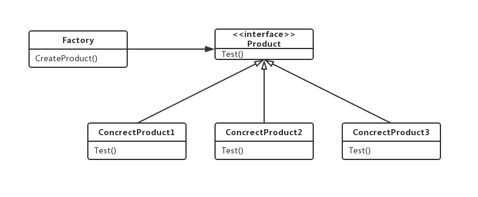
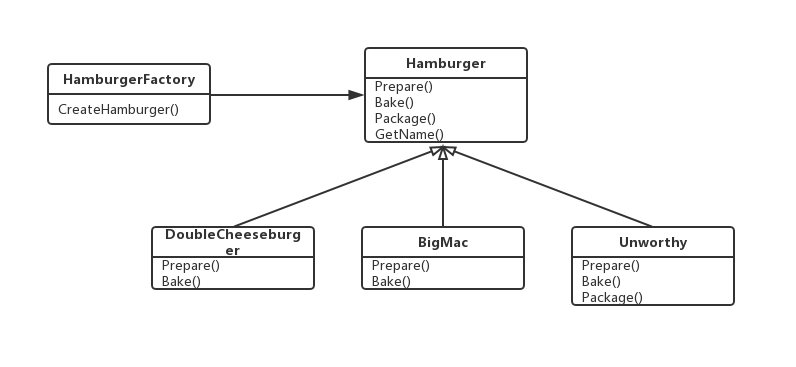

### 简易工厂模式(Easy Factory Pattern)

---

<font size="5">**简易工厂模式**</font>提供一个创建对象实例的功能，而无需关心其具体实现。被创建实例的类型可以是接口，抽象类，也可以是具体的类。

---

**看个例子**

```go
type Api interface {
    Test()
}

type ApiTester struct{
    
}

func (a *ApiTester) Test() {
    fmt.println("this is api tester 1")
}

func main() {
    var api = new ApiTester()
    api.Test() // this is api tester 1
}
```

上述代码看起来有问题吗？看起来没有。

但是注意到在main调用的时候，知道了具体声明的类，也知道了具体的接口。接口的思想是“封装隔离”，而实现类ApiTester应该是被接口Api封装并同调用方隔离开的，也就是说在调用的时候不应该让其知道我声明的具体类是什么。

---

**意图**

选择实现。简单工厂模式的目的在于为调用方选择相应的实现，将调用方和实现之间解耦。即使具体实现发生了变化，调用方也不用做修改

---

**组成部分**

- Product

  需要实现的抽象产品接口

- ConcrectProduct

  对产品接口实现的具体产品类

- Factory

  定义一个工厂对象，该对象的方式实现的对产品接口的选择实现方法



---

**范例代码**

代码：http://192.168.1.189/navi/wiki/tree/master/msa/design_pattern/factory_pattern/factory_pattern_easy_factory/example

范例代码为我们要创建一个汉堡，但是我们只要输入我们要的汉堡类型就可以了，不需要知道这个汉堡是怎么做出来的。



---

**总结**

- 本章介绍的简易工厂模式也可成为静态工厂模式，可以让客户端指定需要生产的产品，但是不需要知道这个产品是如何生产的，生产的具体细节隐藏在工厂中。
- 简单工厂的方法大多是用来创建接口的，但是仔细分析就会发现，真正能实现功能的是具体的实现类，这些实现类是已经做好的，并不是真的要靠简单工厂来创造出来的，简单工厂的方法无外乎就是：实现了选择一个合适的实现类来使用。
- 如果想要完全封装隔离具体实现，让外部只能通过接口来操作封装体，那么可以选用简单通常，让客户端通过工厂来获取相应的接口，而无需关心具体的实现。

---

**缺点**

如果需要在方法里写很多与对象创建有关的业务代码，而且需要的创建的对象还不少的话，我们要在这个简单工厂类里编写很多个方法，每个方法里都得写很多相应的业务代码，而每次增加子类或者删除子类对象的创建都需要打开这简单工厂类来进行修改。这会导致这个简单工厂类很庞大臃肿、耦合性高，而且增加、删除某个子类对象的创建都需要打开简单工厂类来进行修改代码也违反了开-闭原则。

---

资料来源

<https://blog.csdn.net/u012156116/article/details/80857255>