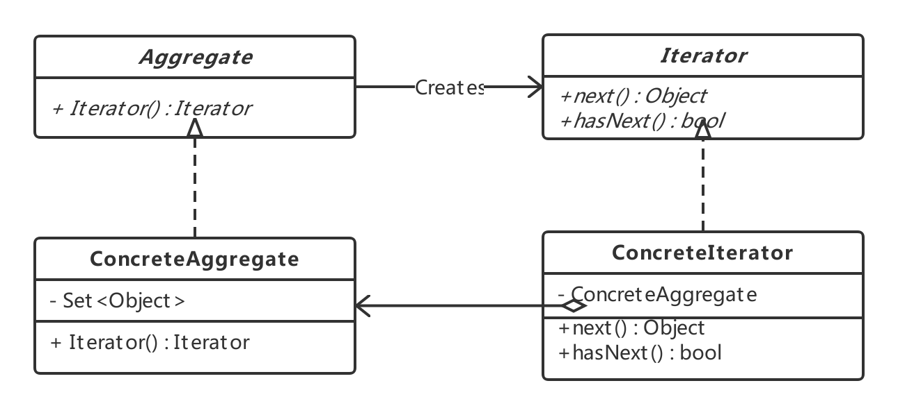

### 迭代器模式(Iterator Pattern)

---

**迭代器模式**提供一种方法顺序访问一个聚合对象中的各个元素，而又不暴露其内部的表示。

---

#### 看个例子

场景：整合工资表数据

客户方已有的工资系统，在内部是采用List来记录工资列表；而新收购的这个家公司的工资系统，在内部是采用数组来记录工资列表。但是幸运的是，两个系统用来描述工资的数据模型差不多。

如果不要整合在一起，两个系统单独输出自己的工资表也是没有问题的。但是，老板希望能够以一个统一的方式来查看所有的工资数据。

问题的核心就是**如何能够以一个统一的方式来访问内部实现不同的聚合对象**

---

#### 认识迭代器模式

迭代器能实现“无需暴露聚合对象的内部实现，就能够访问到聚合对象中的各个元素”的功能，看起来其本质应该是"透明访问聚合对象中的元素"。

迭代器模式的功能主要在于提供对聚合对象的迭代访问。

聚合对象的类型很多，如果对聚合对象的迭代访问跟聚合对象本身融合在一起的话，会影响到聚合对象的可扩展性和可维护性。因此迭代器模式的关键思想就是把**聚合对象的遍历和访问从聚合对象中分离出来**，放入单独的迭代器中。

**迭代器模式类图**

· Iterator：迭代器接口。定义访问和遍历元素的接口；

· ConcreteIterator：具体的迭代器实现对象。实现对聚合对象的遍历，并跟踪遍历时的当前位置；

· Aggregate：聚合对象。定义创建相应迭代器对象的接口；

· ConcreteAggregate：具体聚合对象。实现创建相应的迭代器对象。

---

#### 优点

· 更好的封装性

· 迭代器模式可以让你访问一个聚合对象的内容，而无须暴露该聚合对象的内部表示，从而提高聚合对象的封闭性

· 可以以不同的i案例方式来遍历一个聚合

· 使用迭代器模式，使得聚合对象的内容和具体的迭代算法分离开。这样就可以通过使用不同的迭代器的实例、不同的遍历方式来遍历一个聚合对象了。

· 有了迭代器的接口，则聚合本身就不需要再定义这些接口了，从而简化了聚合的接口定义。

· 迭代器为遍历不同的聚合对象提供了一个统一的接口，使得客户端遍历聚合对象的内容变得更简单。

---

#### 何时选用迭代器模式

· 如果你希望提供访问一个聚合对象的内容，但是又不想暴露它的内部表示的时候，可以使用迭代器模式来提供迭代器接口，从而让客户端只是通过迭代器的接口来访问聚合对象，而无须关心聚合对象的内部实现。

· 如果你希望有多种遍历方式可以访问聚合对象，可以使用迭代器模式

· 如果你希望为遍历不同的聚合对象提供一个统一的接口，可以使用迭代器模式。

---

#### 代码范例

代码：https://github.com/zxmfke/tech_learning_NoteOrBook/edit/master/design_pattern/iterator_pattern/example

代码封装slice和list的iterator

