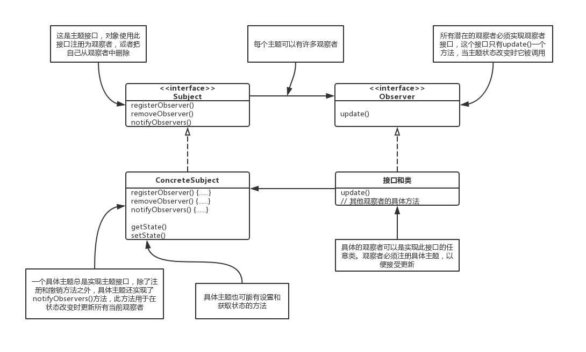
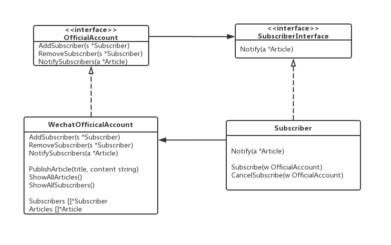

### 观察者模式(Observer Pattern)

---

**观察者模式**定义了对象之间的一对多依赖，这样一来，当一个对象概念状态时，它的所有依赖者都会受到通知并自动更新。

---

#### 认识观察者模式

1. 报社的业务就是出版报纸；
2. 想某家报社订阅报纸，只要他们有新报纸出版，就会给你送最新的报纸。只要你是他们的订户，你就会一直收到新报纸；
3. 当你不再想看报纸的时候，取消订阅，他们就不会再送新报纸来；
4. 只要报社还在运营，就会一直有人向他们订阅报纸或取消订阅报纸。

观察者模式就是“主题”(Subject)加“观察者”(Observer)。

主题和观察者定义了一对多的关系。观察者依赖于此主题，只要主题状态一有变化，观察者就会被通知。根据通知的风格，观察者可能因此新值而更新。

---

#### 以Subject和Observer接口的类设计实现

---

**\### 设计模式**

> **为了交互对象之间的松耦合设计而努力。**
>
> **松耦合的设计之所以能让我们建立有弹性的OO系统，能够应对变化，是因为对象之间的互相依赖降到了最低。**

当两个对象之间松耦合，它们依然可以交互，但是不太清楚彼此的细节。

观察者模式提供了一种对象设计，让主题和观察者之间松耦合。

对于观察者模式，主题只需要知道观察者实现了某个接口(也就是Observe接口)。主题不需要知道观察者的具体类是谁、做了些什么或其他的任何细节。

任何时候我们都可以添加新的观察者。因为主题唯一依赖的东西是一个实现Observer接口的对象列表，所以我们可以随时增加观察者。事实上，在运行时我们可以用新的观察者去取代现有的观察者，主题不会受到任何影响。同样的，也可以在任何时候删除某些观察者。

**有新类型的观察者出现时，主题的代码不需要修改**。假如我们有个新的具体类需要当观察者，我们不需要为了兼容新类型而修改主题的代码，所有要做的就是在新的类里实现此观察者接口，然后注册为观察者即可。主题不乎别的，他只会发送通知给所有实现了观察者接口的对象。

改变主题或观察者其中一方，并不会影响另一方。因为两者是松耦合的，所以只要他们之间的接口仍被遵守，我们就能自由地改变他们。

---

#### 观察者模式如何实现策略模式中的设计模式

> 找出程序中会变化的方面，然后将其和固定不变的方面想分离。

在观察者模式中，会改变的是主题的状态，以及观察者的数目和类型。用这个模式，你可以改变依赖于主题状态的对象，却不必改变主题。

> 针对接口编程，不针对实现编程。

主题与观察者都是用接口。观察者利用主题的接口向主题注册，而主题利用观察者接口通知观察者。这样可以让两者之间运作正常，又同时具有松耦合的有点。

> 多用组合，少用继承。

观察者模式要利用“组合”将许多观察者组合进主题中。对象之间的这种关系不是通过继承产生的，而是在运行时利用组合的方式而产生的。

---

代码范例

代码：https://github.com/zxmfke/tech_learning_NoteOrBook/edit/master/design_pattern/observer_pattern/example

下图为范例代码的类图

代码以订阅者和公众号为例子

订阅者实现订阅者被通知的接口方法Notify，及Subscribe和CancelSubscribe的方法。

微信公众号实现公众号的接口方法AddSubscribers，RemoveSubscribers和NotifySubscribers，及自身实现的PublishAricle, ShowAllArticles 和 ShowAllSubscribers的方法。

订阅者会订阅公众号，公众号随之将新的订阅者加入自己的Subscribers中。当公众号要发布一篇文章时，会调用NotifySubscribers，将新的文章推送给所有的订阅者。订阅者收到推送通知后，会将新的文章信息打印出来。

