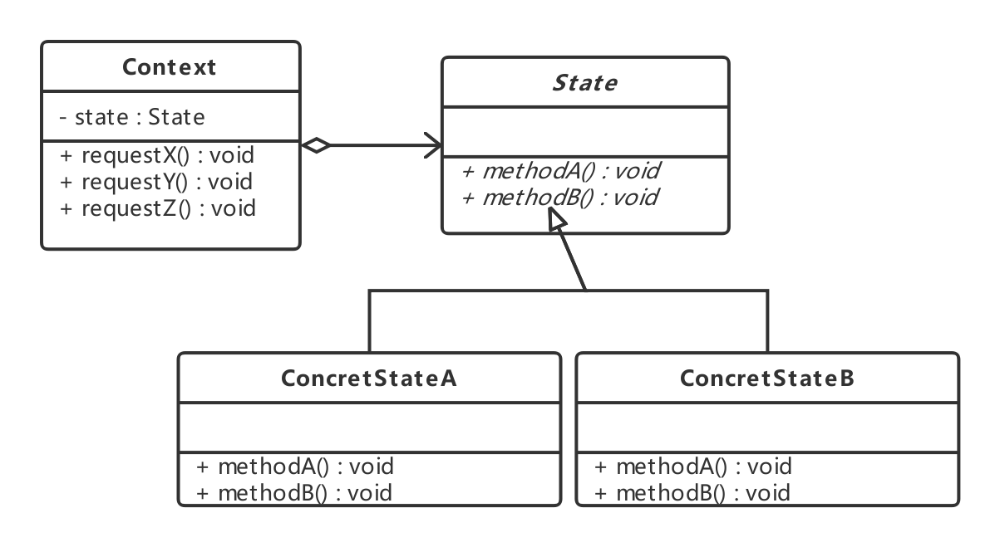

### 状态模式(State Pattern)

---

<font size="5px">**状态模式**</font>允许对象在内部状态改变时改变它的行为，对象看起来好像修改了它的类。

---

#### 看个例子

写一个糖果机的系统，糖果机有4种状态，如下：


1) 没有1块

2) 有1块

3) 售出糖果

4) 糖果售罄

```go
const (
    SOLD_OUT = 0;
	NO_ONEYUAN = 1;
    HAS_ONEYUAN = 2;
    SOLD = 3;
)

type SugarMachine struct{
    state int
    count int
}

func InitSugarMachine(count int) SugarMachine{
    state = SOLD_OUT
    if count > 0 {
        state = NO_ONEYUAN
    }
    return &SugarMachine{
        state : state.
        count : count,
    }
}

func (s *SugarMachine) insertOneYuan() {
    if s.state == HAS_ONEYUAN {
        fmt.Println("已经投了1元了")
    } else if s.state == NO_ONEYUAN {
        state = HAS_ONEYUAN
        fmt.Println("投入1元")
    } else if s.state == SOLD_OUT {
        fmt.Println("不能投钱，糖果已售完")
    } else if s.state == SOLD {
        fmt.Println("稍等，糖果正在出货")
    }
}

func (s *SugarMachine) ejectOneYuan() {
    if s.state == HAS_ONEYUAN {
        state = NO_ONEYUAN
        fmt.Println("正在退钱")
    } else if s.state == NO_ONEYUAN {
        fmt.Println("没有投入的钱")
    } else if s.state == SOLD_OUT {
        fmt.Println("不能退钱，因为你还没有投钱")
    } else if s.state == SOLD {
        fmt.Println("已经售出，不能退钱")
    }
}

func (s *SugarMachine) turnCrank() {
    if s.state == HAS_ONEYUAN {
        s.state = SOLD
        dispense()
        fmt.Println("正在出货")
    } else if state == NO_ONEYUAN {
        fmt.Println("请先投钱")
    } else if state == SOLD_OUT {
        fmt.Println("抱歉，没有糖果了")
    } else if state == SOLD {
        fmt.Println("已经转过了")
    }
}

func (s *SugarMachine) dispense() {
    if state == HAS_ONEYUAN {
        fmt.Println("发生错误")
    } else if state == NO_ONEYUAN {
        fmt.Println("请先付钱")
    } else if state == SOLD_OUT {
        fmt.Println("发生错误")
    } else if s.state == SOLD {
        fmt.Println("糖果正在滚出")
        s.count = s.count - 1
        if s.count == 0 {
            s.state = SOLD_OUT
        } else {
            s.state = NO_ONEYUAN
        }
    }
}
```

以上是糖果机的代码，我们实现了所有动作在不同状态下的行为。但上面的代码是一份好的代码吗？

如果我们现在想多加一个状态会怎么样呢？我们首先多定义一个状态的值，然后在每个操作最后再多加一个else来出来这个新状态的行为。

上述代码出现的问题：

· 没有遵守开放-关闭原则

· 状态切换隐藏在条件语句中，所以不是很明显

· 没有把会改变的地方包起来

· 新加入的代码可能会对之前的逻辑引来新的bug

---

#### 认识状态模式

**状态决定行为**

所谓对象的状态，通常指的就是对象实例的属性的值；而行为指的就是对象的功能，行为大多可以对应到方法上。

状态模式的功能就是分离状态的行为，通过维护状态的变化，来调用不同状态对应的不同功能。

由于状态是在运行期间被改变的，因此行为也会在运行期间根据状态的改变而改变，看起来，同一个对象，在不同的运行时刻，行为也是不一样的，就像是类被修改了一样。

从上面的例子可以看出，我们需要把状态和状态对应的行为从原来的代码中分离出来，把每个状态所对应的功能处理封装在一个独立的类里，这样选择不同处理的时候，其实就是在选择不同的状态处理类。

##### 状态模式类图



· Context：上下文，通常用来定义客户感兴趣的接口。上下文是持有状态的对象，但是上下文自身并不处理跟状态相关的行为，而是把处理状态的功能委托给了状态对应的状态处理类来处理；

· State：状态接口，用来封装与上下文的一个特定状态所对应的行为；

· ConcreteState：具体实现状态处理的类，每个类实现一个跟上下文相关的状态的具体处理。

如果没有上下文，那么就退化回到只有接口和实现了，正式通过接口，把状态和状态对应的行为分开，才使得通过状态模式设计的程序易于扩展和维护。

---

#### 与策略模式的区别

这两个模式从模式结构上看是一样的，但是实现的功能或意图是不一样的。

状态模式是根据状态的变化来选择相应的行为，不同的状态对应不同的类，每个状态对一个对应的类实现了该状态对应的功能，在实现功能的同时，还会维护状态数据的变化。这些实现状态对应的功能类之间是不能相互替换的。策略模式是根据需要或者是客户端的要求来选择想要的实现类，各个实现类是平等的，是可以相互替换的。

策略模式可以让客户端来选择需要使用的策略算法；而状态模式一般是由上下文，或者是在状态实现类里面来维护具体的状态数据，通常不由客户端来指定状态。


---

#### 优点

· 简化应用逻辑控制
   状态模式使用单独的类类封装一个状态的处理。如果把一个大的程序控制分成很多小块，每个定义一个状态代表，那么就可以把这些逻辑控制的代码分散到很多单独的状态中去，这样就把着眼点从执行状态提高到整个对象的的状态，使得代码结构化和意图更清晰，从而简化应用的逻辑控制

·  更好地分离状态和行为

·  更好的扩展性

·  显式化进行状态转换
   状态模式为不同的状态引入独立的对象，使得状态的转换变得更加明确。而且状态对象可以保证上下文不会发生内部状态不一致的情况，因为上下文中只有一个变量来记录状态对象，只要为这一个变量赋值就可以了。

---

#### 代码范例

代码：https://github.com/zxmfke/tech_learning_NoteOrBook/edit/master/design_pattern/state_pattern/example

范例代码就是用状态模式实现例子的代码

