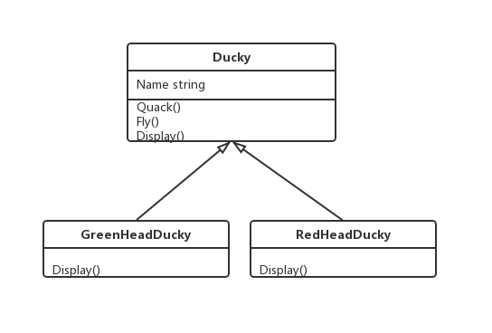
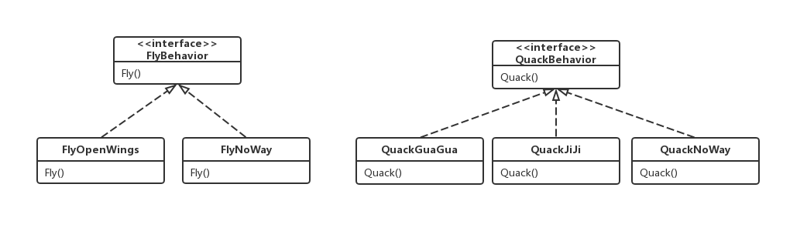
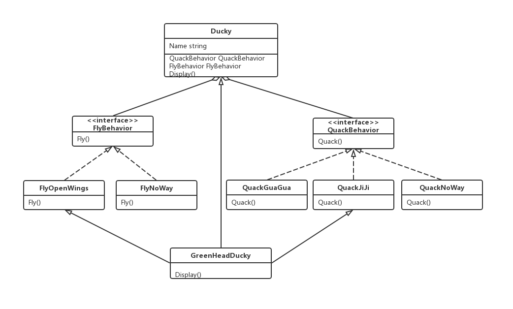

### 策略模式(Strategy Pattern)

---

<font size="5px">**策略模式**</font>定义了算法组，分别封装起来，让他们之间可以互相替换，此模式让算法的变化独立于使用算法的客户。

---

看个例子

```go
type Ducky struct{
    
}

func (*Ducky) Quack() {
    fmt.Println("I'm quacking")
}

func (*Ducky) Fly() {
    fmt.Println("I'm flying")
}

func(*Ducky) Display() {
    fmt.Println("I'm beautify ducky")
}

type GreenHeadDucky struct{
    Ducky
}

func (*GreenHeadDucky) Display() {
    fmt.Println("I'm a green head ducky")
}

type ReadHeadDucky struct{
    Ducky
}

func (*ReadHeadDucky) Display() {
    fmt.Println("I'm a red head ducky")
}
```



从上方代码块看到我们有一个鸭子的类，这个类有三个方法，分别为Quack()，Fly()和Display()。然后分别有GreenHeadDucky(绿头鸭)和RedHeadDucky(红头鸭)去继承Ducky这个类，那么绿头鸭和红头鸭就都有了Quack()，Fly()和Display()这三个方法。由于绿头鸭和红头鸭的样子不同，它们各自覆写了Ducky的Display()，有自己的Display()。假设有其他鸭子来就直接继承Ducky类，那这只鸭子就能飞，能叫了，简单快速，还可以通过继承的概念，复用代码。

**#问题1**

> 我们的鸭子学会了游泳

既然鸭子都学会游泳了，那我们在Ducky里加一个Swim()就好了吧，这样绿头鸭和红头鸭和其他鸭子就都会游泳了。

```go
func (*Ducky) Swim() {
    fmt.Println("I'm swimming")
}
```

**#问题2**

> 告诉小伙伴，我这个代码很强，直接继承Ducky类，你就有一只鸭子了，然后小伙伴加了一只木头鸭

```go
type WoodDucky struct{
    Ducky
}

func (*WoodDucky) Display() {
    fmt.Println("I'm made by wood")
}
```

小伙伴按照你说的直接继承Ducky类，然后一只木头鸭就开始飞，还能叫了，这明显是不对。那既然你是一只木头鸭，那直接覆写掉Quack()，Fly()方法就好了嘛。

```go
func (*WoodDucky) Quack() {
    fmt.Println("I can not quack")
}

func (*WoodDucky) Fly() {
    fmt.Println("I can not fly")
}
```

看起来可以啊，那就覆写好了呗。

**#问题3**

> 小伙伴跑过来说:"我还有只橡皮鸭，不会飞的鸭......"

emmm，覆写感觉会覆写到崩溃。每次都要重新定义每个鸭子的方法，这也太复杂了。但是我们可以将Quack()，Fly()抽象成接口，会这些行为的鸭子自己去实现不就好了吗？这样确实可以解决，但是我们又不能复用代码，每个鸭子都要去实现各自的方法。其实与覆写没有多大的区别，反而让代码更加冗余。

**\### 设计原则**

> **找出应用中可能需要变化之处，把它们独立出来，不要和那些不需要变化的代码混合在一起。**

> **把会变化的部分取出并“封装”起来，好让其他部分不会受到影响**。

从问题1到问题3，我们都在解决新鸭子和新行为的问题上。如果每次新的鸭子来，都会使某方面的代码发生变化，那么你就可以确定地将这份代码抽出来，和其他稳定代码有所区分。很明显地，在这个Ducky类中，鸭子的行为是一直在变化的，所以我们将鸭子的行为抽象出来。**那如何抽象？**

**\### 设计原则**

> **针对接口编程，而不是针对实现编程。**

我们利用接口代表每个行为，比方说，FlyBehavior与QuackBehavior，而行为的每个实现都将实现其中的一个接口。所以这Ducky类不会负责实现Fly和Quack，反而是由我们这两组Behavior类实现。以前的做法：行为来自Ducky类的具体实现，获知继承某个接口并由子类自行实现而来。这两种做法都是依赖于“实现”，我们被实现绑得死死的，没办法更改行为（会很复杂）。现在的做法，Ducky的子类将使用Behavior表示行为，但是Behavior的实现不会被绑定在Ducky的子类中。

```go
type QuackBehavior interface{
	Quack() //how you fly
}

type QuackGuaGua struct{

}

func NewQuackGuaGua() QuackBehavior{
	return new(QuackGuaGua)
}

func (*QuackGuaGua) Quack() {
	fmt.Println("I'm quacking: Gua Gua")
}

type QuackNoWay struct{

}

func NewQuackNoWay() QuackBehavior{
	return new(QuackNoWay)
}

func (*QuackNoWay) Quack() {
	fmt.Println("I'm can't Quack")
}

type QuackJiJi struct {

}

func NewQuackJiJi() QuackBehavior{
	return new(QuackJiJi)
}

func (*QuackJiJi) Quack() {
	fmt.Println("I'm quacking: Ji Ji")
}
```

```go
type FlyBehavior interface{
   Fly() //how you fly
}

type FlyOpenWings struct{

}

func NewFlyOpenWings() FlyBehavior{
   return new(FlyOpenWings)
}

func (*FlyOpenWings) Fly() {
   fmt.Println("I'm spreading wings to fly")
}

type FlyNoWay struct{

}

func NewFlyNoWay() FlyBehavior{
   return new(FlyNoWay)
}

func (*FlyNoWay) Fly() {
   fmt.Println("I'm can't fly")
}
```



这样的设计，可以让飞行和呱呱叫的动作被其他的对象复用，因为这些行为已经与Ducky类无关。而我们可以新增一些行为，不会影响到既有的行为，而不会影响“使用”到Fly的其他Ducky的子类。这样一来，**有了继承的“复用”好处，却没有继承所带来的包袱**。

之后的Ducky类就应该修改为

```go
type Ducky struct {
   FlyBehavior   FlyBehavior
   QuackBehavior QuackBehavior
}
```

当有个新鸭子的时候，只需要指定需要哪一些行为就可以，以WoodDucky为例。这种做法和“继承”不同的地方在于，Ducky的行为不是继承来的，而是和适当的行为对象“组合”来的。

```go
func NewWoodDucky() *WoodDucky {
	var ducky = new(WoodDucky)
	ducky.QuackBehavior = NewQuackNoWay()
	ducky.FlyBehavior = NewFlyNoWay()
	ducky.SetName("WoodDucky")
	return ducky
}
```

**\### 设计原则**

> **多用组合，少用继承。**

组合建立系统，有比较大的弹性。

---

总结：策略模式是对算法的包装，是把使用算法的责任和算法本身分割开来，委派给不同的对象管理。策略模式通常把一个系列的算法包装到一系列的策略类里面，作为一个抽象策略类的子类。用一句话来说，就是：“准备一组算法，并将每一个算法封装起来，使得它们可以互换”。适用场景在于，**对象的行为在不同场景下会有所改变**。

---

代码范例：http://192.168.1.189/navi/wiki/tree/master/msa/design_pattern/strategy_pattern/example

代码中的class_diagram如下


