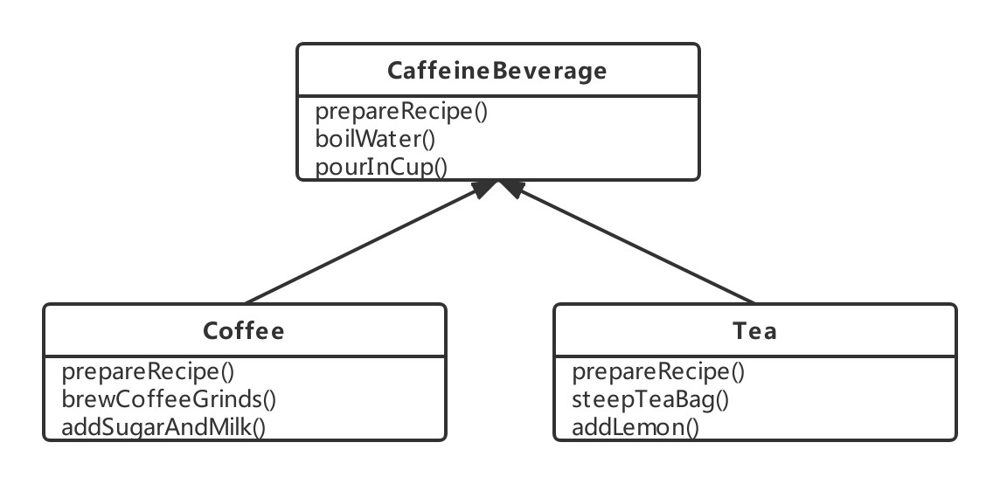
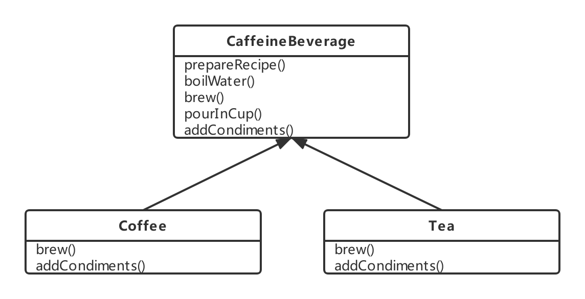
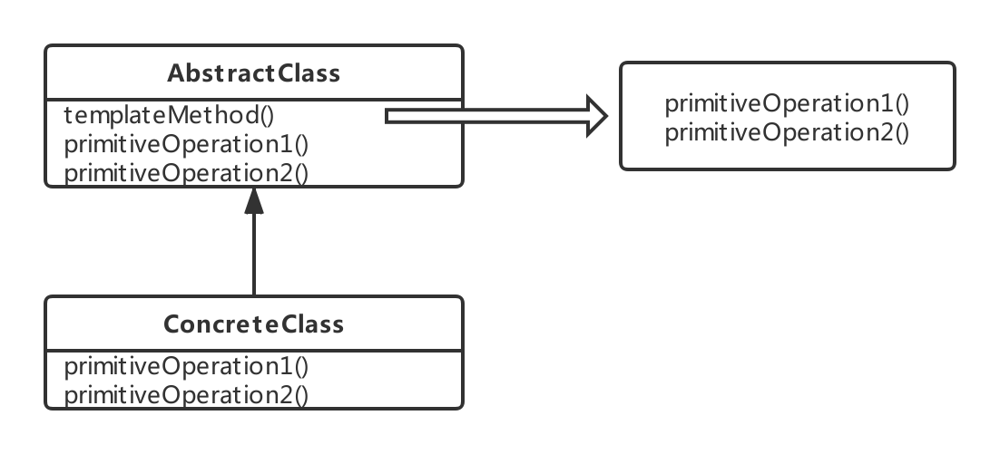

### 模板方法模式(Template Method Pattern)

---

<font size="5px">**模板方法模式**</font>在一个方法中定义一个算法的骨架，而将一些步骤延迟到子类中。模板方法使得子类可以在不改变算法结构的情况下，重新定义算法中的某些步骤。

---

#### 看个例子

场景：一家店提供的饮料

冲泡咖啡的方法：

1) 把水煮沸

2) 用沸水冲泡咖啡

3) 把咖啡倒进杯子

4) 加糖和牛奶

```go
type Coffee struct {}

func (c *Coffee) makeCOffee() {
    c.boilWater()
    c.brewCoffeeGrinds()
    c.pourIntoCup()
    c.addSugarAndMilk()
}

func (c *Coffee) boilWater() {
    fmt.Println("把水煮沸")
}

func (c *Coffee) brewCoffeeGrinds() {
    fmt.Println("用沸水冲泡咖啡")
}

func (c *Coffee) pourIntoCup() {
    fmt.Println("把咖啡倒进杯子")
}

func (c *Coffee) addSugarAndMilk() {
    fmt.Println("加糖和牛奶")
}
```

泡茶的方法

1) 把水煮沸

2) 用沸水浸泡茶叶

3) 把茶倒进杯子

4) 加柠檬

```go
type Tea struct {}

func (t *Tea) makeCOffee() {
    t.boilWater()
    t.brewCoffeeGrinds()
    t.pourIntoCup()
    t.addSugarAndMilk()
}

func (t *Tea) boilWater() {
    fmt.Println("把水煮沸")
}

func (t *Tea) steepTeaBag() {
    fmt.Println("用沸水浸泡茶叶")
}

func (t *Tea) pourIntoCup() {
    fmt.Println("把茶倒进杯子")
}

func (t *Tea) addLemon() {
    fmt.Println("加柠檬")
}
```


从上面两个代码可以看出，咖啡类和茶类存在着重复的代码，并且之后扩展会比较麻烦。以以往的经历，对这种代码我们会对相同的部分抽出来，让不同的部分放在各自子类实现。我们可以改出下面一个版本。




但是他们的相同点就只有这些了吗？

---

#### 认识模板方法模式

模板方法模式将算法定义成一组步骤，其中的任何步骤都可以是抽象的，由子类实现。

在上面的例子，可以看出其实冲咖啡和泡茶其实是遵循一个步骤的，并且这些步骤某些方法是可以抽象成一个方法的。因此我们设计出如下结构。

泡茶和冲咖啡的第二个方法和第四个方法可以抽象为冲泡和加调料。而整个做饮料的步骤就在perpareRecipe内

1) 把水煮沸

2) 冲泡

3) 把饮料倒进杯子

4) 加调料



**模板的写法**

· 模板方法： 定义算法骨架的方法

· 具体的操作：在模板中直接实现某些步骤的方法。通常这些步骤的实现散发是固定的，而且是不怎么变化的，因此可以将其当作公共功能实现在模板中。

· 具体的AbstarctClass操作：在模板中实现某些公共功能，可以提供给子类使用，一般不是具体的算法步骤的而实现，而是一些辅助的公共功能。

· 原语操作：在模板中定义的抽象操作，通常是模板方法需要调用的操作，是必须的操作，而且在弗雷中还没有办法确定下来如何实现，需要子类类真正实现的方法。

· 钩子操作：在模板中dinginess，并提供默认实现的操作。这些方法通常被视为可扩展的点，但不是必须的，子类可以有选择地覆盖这些方法。(上面例子的钩子在下方描述)

**模板方法模式类图**



模板方法在实现算法的过程中，用到两个原语(primitiveOperation)操作。模板方法本身和这两个的具体实现之间被解耦了。

---

#### 模板方法模式钩子

钩子是一种被声明在抽象类中的方法，但只有空的或者默认的实现。钩子的存在，可以让子类有能力对算法的不同点进行挂钩。要不要挂钩，由子类自行决定。以上面例子继续。

我们加一个是否需要加调料的钩子，创建一个有钩子的超类

```go
type CaffeinBeverageWithHook struct{}

func (c *CaffeinBeverageWithHook) prepareRecipe() {
    c.boilWater()
    c.brew()
    c.pourInCup()
    if ( c.customerWantsCondiments() ) {
        c.addCondiments()
    }
}

func (c *CaffeinBeverageWithHook) boilWater() {
    fmt.Println("把水煮沸")
}

func (c *CaffeinBeverageWithHook) pourInCup() {
    fmt.Println("把饮料倒进杯子")
}

func (c *CaffeinBeverageWithHook) customerWantsCondimentsI() bool{
    return true
}
```

实现咖啡带钩子的类

```go
type CoffeeWithHook struct{
    CaffeinBeverageWithHook
}

func (c *CoffeeWithHook) brew() {
    fmt.Println("冲泡咖啡粉")
}

func (c *CoffeeWithHook) addCondiments() {
    fmt.Println("加糖和牛奶")
}

func (c *CoffeeWithHook) customerWantsCondimentsI() bool{
    var	a string
    fmt.Scanf("是否要加糖和奶(yes/no)",&a)
    return a == "yes"
}
```

这样就可以通过钩子来控制消费者是否需要加调料了。

---

#### 设计模式

> **好莱坞原则**
>
> **别调用(打电话给)我们，我们会调用(打电话给)你。**

依赖腐败：当高层组件依赖低层组建，而低层组件又依赖高层组件，而高层组件又依赖边侧组件，而边侧组件又依赖低层组件时，依赖腐败就发生了。

在好莱坞原则下，低层组件可以将自己挂钩到系统上，但是高层组件会决定什么时候和怎样使用这些低层组件。

好莱坞原则也在工厂方法和观察者中体现。

好莱坞原则与依赖倒置原则的区别：依赖倒置主要是尽量避免使用具体类，而多使用抽象，更注重在设计中避免依赖。好莱坞更倾向创建一个弹性的设计，允许低层结构能够互相操作，而又防止其他类太过依赖他们。

---

#### 优缺点

· 优点就是代码复用。通过把子类的公共功能提炼和抽取，把公共部分放到模板中去实现。

· 缺点就是算法框架不容易升级。如果要对模板中的算法骨架进行变更，可能就会要求所有相关的子类进行相应的变化。

---

#### 代码范例

代码：http://192.168.1.189/navi/wiki/tree/master/msa/design_pattern/template_method_pattern/example

范例代码就是实现上面讲的例子

